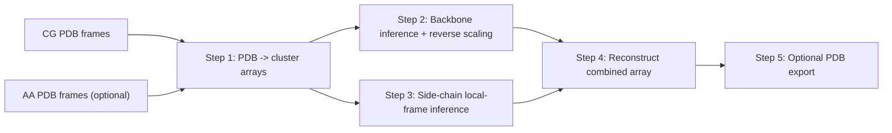

# BackMapNet
BackMapNet is a deep-learning framework for reconstructing all-atom protein coordinates from coarse-grained (CG) trajectories.

## Overview
BackMapNet performs local coordinate reconstruction with two coordinated models:

- A backbone model that predicts `N, CA, C, O` per residue.
- A side-chain model that predicts residue-specific heavy-atom coordinates in local frames.

This split improves transferability across proteins with different global folds and sequences.  
The models were trained on 12 protein trajectories.

Framework figure placeholder:

```text
[Add publication-quality workflow diagram here]
```

## Pipeline Summary
BackMapNet is run through a single public entrypoint: `BackMapNet.sh`.



## Tested Software Matrix
The repository does not currently include a lockfile; the matrix below reflects the active environment used for this project on March 17, 2026.

| Profile | Conda env | Python | NumPy | TensorFlow | Keras | h5py | Intended use |
| --- | --- | --- | --- | --- | --- | --- | --- |
| Runtime | `mytfenv311` | `3.11.15` | `2.4.2` | `2.20.0` | `3.13.1` | `3.16.0` | BackMapNet pipeline execution |

To print your exact runtime versions:

```bash
python3 - <<'PY'
import importlib, sys
print("python", sys.version.split()[0])
for name in ["numpy", "tensorflow", "keras", "h5py"]:
    try:
        mod = importlib.import_module(name)
        print(name, mod.__version__)
    except Exception:
        print(name, "MISSING")
PY
```

## Installation
Create and activate an environment, then install core dependencies:

```bash
conda create -n backmapnet python=3.11 -y
conda activate backmapnet
pip install numpy tensorflow keras h5py
```

## Repository Layout
Top-level structure:

- `BackMapNet.sh`: public pipeline entrypoint.
- `run_all.sh`: backward-compatible wrapper that forwards to `BackMapNet.sh`.
- `bash_scripts/`: stage-level shell workflows.
- `python_scripts/`: array builders, model evaluation, reconstruction, and PDB writing.
- `weights/`: backbone/side-chain model files and priors.

## Input Conventions
BackMapNet expects frame-indexed PDB filenames:

- CG directory (`--cg-pdb-dir`): `CG_frame_<idx>.pdb`
- Backbone AA directory (`--aa-pdb-dir`, optional): `frame_<idx>.pdb`
- Side-chain AA directory (`--aa-sc-pdb-dir`, required when full side-chain mode is used): `frame_<idx>_SC.pdb`

If `--aa-pdb-dir` is provided, BackMapNet automatically switches from CG-only mode to full mode.

## Running BackMapNet
Show CLI help:

```bash
bash /absolute/path/to/backbone/BackMapNet.sh --help
```

### CG-only mode (default)
```bash
bash /absolute/path/to/backbone/BackMapNet.sh \
  --pdb-name IgE \
  --cg-pdb-dir /data/IgE/cg \
  --jobs 8
```

### Full mode (backbone + side-chain targets)
```bash
bash /absolute/path/to/backbone/BackMapNet.sh \
  --pdb-name IgE \
  --cg-pdb-dir /data/IgE/cg \
  --aa-pdb-dir /data/IgE/aa_backbone \
  --aa-sc-pdb-dir /data/IgE/aa_sidechain \
  --jobs 8
```

### Optional PDB export
```bash
bash /absolute/path/to/backbone/BackMapNet.sh \
  --pdb-name IgE \
  --cg-pdb-dir /data/IgE/cg \
  --write-pdb 1 \
  --pdb-frame-spec all
```

## Output Files
Typical outputs are generated in the run directory:

- `backbone_<PDB>_prediction.npy`
- `backbone_<PDB>_actual.npy` (full mode only)
- `sidechain_<PDB>_prediction.npy`
- `combined_<PDB>_prediction.npy` (CG-only)
- `combined_<PDB>_actual.npy` (full mode)
- `pdb_frames_<PDB>/` (when `--write-pdb 1`)

## Atomic Mapping Specification
This section defines the atom ordering used by reconstruction and PDB writing.

### Backbone mapping
Per residue:

| CG feature | Reconstructed atoms | Atom order |
| --- | --- | --- |
| `BB` bead | Backbone heavy atoms | `N, CA, C, O` |

### Side-chain mapping
Per residue, side-chain heavy atoms are produced in this fixed order:

| Residue | Side-chain atom order |
| --- | --- |
| ALA | `CB` |
| ARG | `CB, CG, CD, NE, CZ, NH1, NH2` |
| ASN | `CB, CG, OD1, ND2` |
| ASP | `CB, CG, OD1, OD2` |
| CYS | `CB, SG` |
| GLN | `CB, CG, CD, OE1, NE2` |
| GLU | `CB, CG, CD, OE1, OE2` |
| GLY | *(no side-chain atoms)* |
| HIS | `CB, CG, ND1, CE1, NE2, CD2` |
| ILE | `CB, CG2, CG1, CD` |
| LEU | `CB, CG, CD1, CD2` |
| LYS | `CB, CG, CD, CE, NZ` |
| MET | `CB, CG, SD, CE` |
| PHE | `CB, CG, CD1, CE1, CZ, CE2, CD2` |
| PRO | `CD, CG, CB` |
| SER | `CB, OG` |
| THR | `CB, CG2, OG1` |
| TRP | `CB, CG, CD1, NE1, CE2, CZ2, CH2, CZ3, CE3, CD2` |
| TYR | `CB, CG, CD1, CE1, CZ, OH, CE2, CD2` |
| VAL | `CB, CG1, CG2` |

### Final merged array order
In `combined_<PDB>_*.npy`, each residue is assembled as:

1. Backbone atoms: `N, CA, C, O`
2. Side-chain atoms: residue-specific order from the table above

## Notes
- Use `BackMapNet.sh` as the public interface. Internal scripts are implementation details and may change.
- For publication reproducibility, record your exact environment with the version probe command above.
